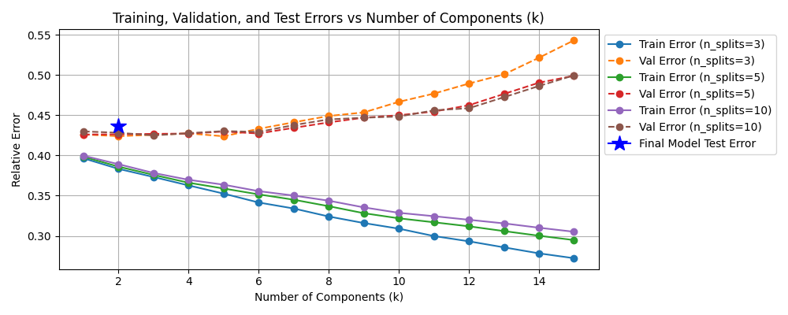

# Hilarious-Jokes--Predictive-Model-and-Classification
This is a basic Machine-Learning analysis of hilarious-joke data that was collected in Dr. Eric Hallman's Mathematics of Scientific Computing course at NCSU. This is an extension and further analysis of these hilarious jokes.
---
## Workflow
- We first perform some data cleaning on our dataset
    - Rescale data
    - Impute missing values
- Perform exploritory data analysis
    - KMeans clustering and visual representations
    - Explore joke similarity and humor similarity
- Create predictive models
    - Split survey responses training, testing; X data (input variables), and Y data (output/predicted responses)
    - Use scikit-learn's KFold package to use cross validation to assess different model hyperparameters
    - Begin constructing Linear Regression Model:
        - First, we reduce the dimensionality of the data using Principle Component Analysis
        - Then we compare how training and validation sets compare at different dimensions using cross-validation
        - Due to the small nature of our dataset (total features ~= total survey respondants), we error on the side of reducing dimension as much as possible and select a model that projects all data onto the first two principle components
        - 
    - Begin Neural Network Model:
        - The expectation is that a 'shallow' Neural Net in combination with PCA will yield results that do not overfit the training data and still have errors in validation data that are comparable to the training errors
        - To tune hyperparameters, we use cross-validation along with a grid-search method to find the combination of hyperparameters that minimize the validation error averaged across all training-validation folds in the data
        - The optimal hyperparamters are: [n_deep_layers=4, nodes_per_layer=16, PCA_dimension=3, batch_size=8, num_epochs=50] with a relative error in the frobeneus norm of 0.420 in the validation set and 0.391 in the training set
        - Complicating the model beyond this point increases the validation error while decreasing the training error, indicating that our model is overfitting. 
##
- Future Steps: 
    - An analysis of the results show that the models do an okay job at predicting the respondants' sentiment towards new jokes; however, the magnitude of the respondants' rating for an unseen joke is not predicted to a high degree of accuracy. I hypothesize that with better data preprocessing this issue can be improved. 
    - The next step is to fit each surveyee's responses to a normal distribution. We will set all respondants' mean joke rating to 0.5, with a standard deviation of 0.15. All respondants' mean joke rating and standard deviation can be used later to transform back to the 1 to 10 scale given on the survey. 
        